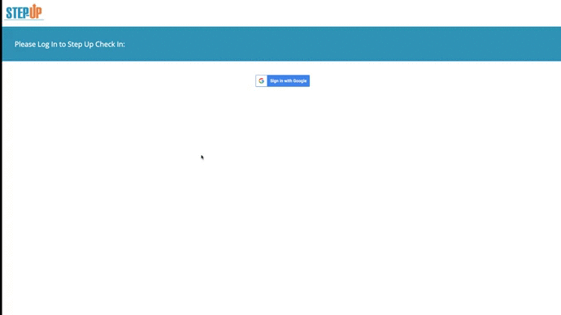
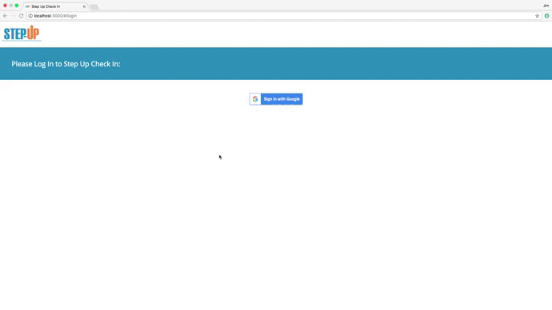
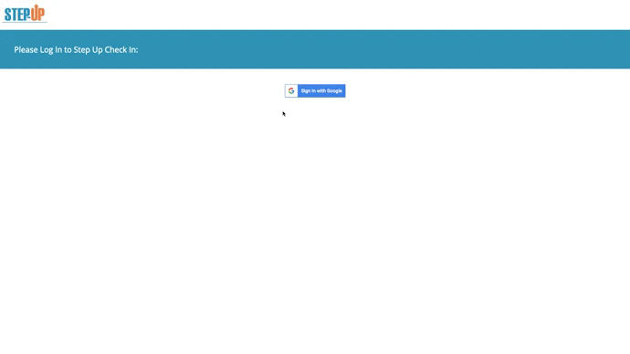

Step-Up Check-In
======

Our application, Step-Up Check-In, will allow students to give weekly feedback on their work experiences via their mobile devices. Application administrators will be able to access and analyze this data through the application dashboard and provide additional support to students as needed based on their responses.

### Prerequisites

1. npm install twilio --save
2. npm install angular --save
3. npm install angular-route --save
4. npm install angular-material --save
5. npm install angular-animate --save
6. npm install angular-aria --save
7. npm install grunt --save-dev
8. npm install grunt-contrib-uglify --save-dev
9. npm install grunt-contrib-copy --save-dev
10. npm install chartjs --save

### Installing

Demo
-------

### Creating Feedback form and Intern mobile walkthrough:

### Intern data overview:

### Import/Export:

### Admin View:

Technology Used:
-------
- HTML5
- CSS3
- JavaScript
- AngularJS
- Twilio
- Google OAuth
- PostgresSQL
- Postico
- ExpressJS
- Node.js
- Heroku
- Grunt

Version:
---

1.0.0

Authors:
----

Jim Vang, Zeinab Hassan, Matt Larson, Tessa Ganser

Acknowledgments:
-----

Our instructors at Prime Digital Academy: Millie Walsh and Luke Schlangen
